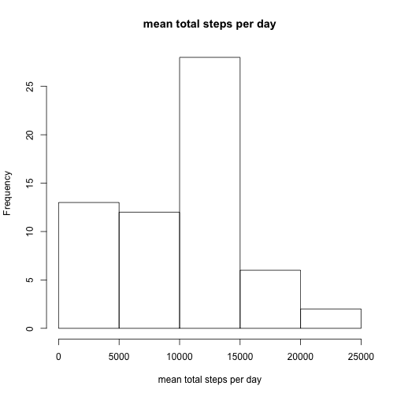
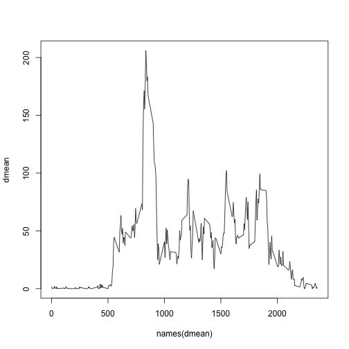
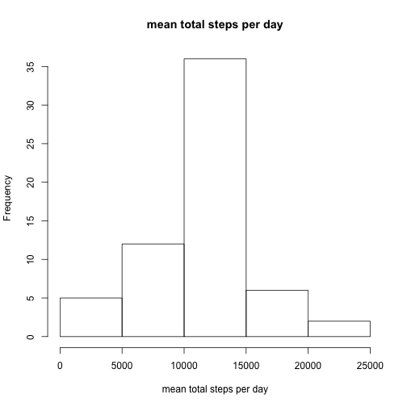
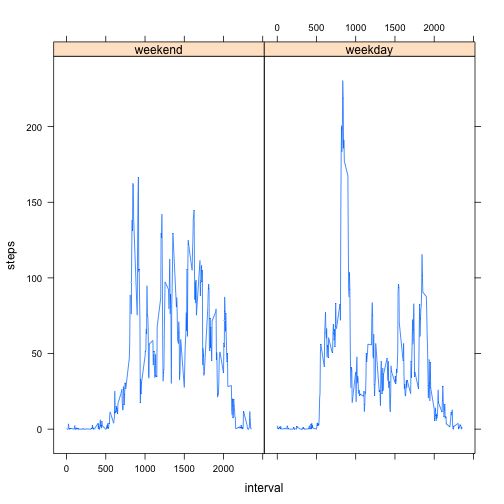

Reproducible Research, Peer Assessments 1
=========================================

## Loading and preprocessing the data

```r
unzip("activity.zip")
dt <- read.csv("activity.csv")
dt$date <- as.Date(dt$date)
```

## What is mean total number of steps taken per day?

make a histogram of the total number of steps taken each day

```r
dsum1 <- tapply(dt$steps, dt$date, sum, na.rm=TRUE)
hist(dsum1, xlab="mean total steps per day", main="mean total steps per day")
```

 

Calculate and report the mean and median total number of steps taken per day

```r
mean(dsum1)
```

```
## [1] 9354
```

```r
median(dsum1)
```

```
## [1] 10395
```

## What is the average daily activity pattern?

Make a time series plot (i.e. type = "l") of the 5-minute interval (x-axis) and the average number of steps taken, averaged across all days (y-axis)

```r
dmean <- tapply(dt$steps, dt$interval, mean, na.rm=TRUE)
plot(names(dmean), dmean, type="l")
```

 

Which 5-minute interval, on average across all the days in the dataset, contains the maximum number of steps?

```r
sort(data.frame(dmean)$dmean, decreasing=TRUE)[1]
```

```
##   835 
## 206.2
```

## Imputing missing values

Calculate and report the total number of missing values in the dataset (i.e. the total number of rows with NAs)

```r
nrow(dt[is.na(dt$steps),])
```

```
## [1] 2304
```

Devise a strategy for filling in all of the missing values in the dataset - I used the mean for the 5 minute interval

```r
dt2 <- dt
for (n in names(dmean)) {
    dt2[dt2$interval == n & is.na(dt2$steps),]$steps <- dmean[[n]]
}
dsum2 <- tapply(dt2$steps, dt2$date, sum, na.rm=TRUE)
hist(dsum2, xlab="mean total steps per day", main="mean total steps per day")
```

 

```r
mean(dsum2)
```

```
## [1] 10766
```

```r
median(dsum2)
```

```
## [1] 10766
```

## Are there differences in activity patterns between weekdays and weekends?

Make a panel plot containing a time series plot

```r
library("lattice")
wk <- data.frame(1:nrow(dt2))
names(wk) <- "wk"
dt2.wk <- cbind(dt2, wk)
dt2.wk.end <- dt2.wk[weekdays(dt2.wk$date) == "Sunday" | weekdays(dt2.wk$date) == "Saturday",]
dt2.wk.day <- dt2.wk[weekdays(dt2.wk$date) != "Sunday" & weekdays(dt2.wk$date) != "Saturday",]
dt2.wk.end$wk <- "weekend"
dt2.wk.day$wk <- "weekday"
dmean2.end <- tapply(dt2.wk.end$steps, dt2.wk.end$interval, mean, na.rm=TRUE)
dmean2.day <- tapply(dt2.wk.day$steps, dt2.wk.day$interval, mean, na.rm=TRUE)
df.dmean2.end <- data.frame(dmean2.end, as.numeric(names(dmean2.end)), "weekend")
df.dmean2.day <- data.frame(dmean2.day, as.numeric(names(dmean2.day)), "weekday")
colnames(df.dmean2.end) <- c("steps", "interval", "wk")
colnames(df.dmean2.day) <- c("steps", "interval", "wk")
dmean2 <- rbind(df.dmean2.end, df.dmean2.day)
xyplot(steps ~ interval | wk, data=dmean2, type="l")
```

 
